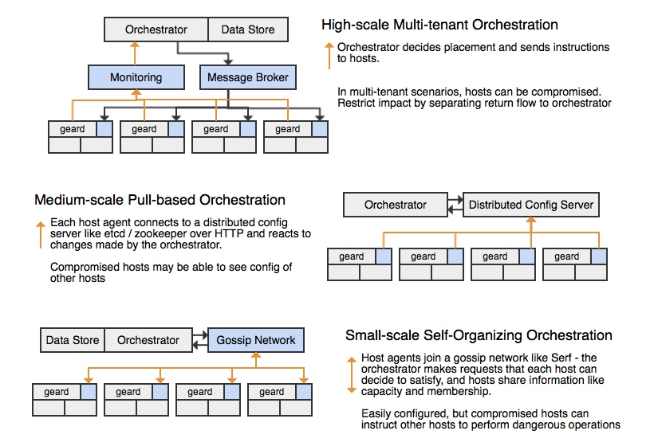

How can geard be used in orchestration?
---------------------------------------

[geard](https://github.com/openshift/geard) is intended to be useful in different scales of container management:

* as a simple command line tool that can quickly generate new unit files and complement the systemctl command line
* as a component in a large distributed infrastructure under the control of a central orchestrator
* as an extensible component for other forms of orchestration

As this is a wide range of scales to satisfy, the core operations are designed to be usable over most common transports - including HTTP, message queues, and gossip protocols.  The default transport is HTTP, and a few operations like log streaming, transferring large binary files, or waiting for operations to complete are best modeled by direct HTTP calls to a given server.  The remaining calls expect to receive a limited set of input and then effect changes to the state of the system - operations like install, delete, stop, and start.  In many cases these are simple passthrough calls to the systemd DBus API and persist additional data to disk (described below).  However, other orchestration styles like pull-from-config-server could implement a transport that would watch the config server for changes and then invoke those fundamental primitives.

One responsibility of the transport layer is authentication and authorization of incoming requests - it is expected that transports would be configured to handle that responsibility and that geard would be minimally aware of the identity of the sender.  Under HTTPS that might be provided by a distributed public key infrastructure (PKI) where the orchestrator has a private key and can sign those requests with hosts that are configured to trust the orchestrator public key (via client certs).  Over a message bus such as ActiveMQ or Qpid TLS and queue permissions would perform much the same function.

From the gear CLI, you can perform operations directly as root (use the embedded gear API library code) or connect to one or more geard instances over HTTP (or another transport).  This works well for managing a few servers or interacting with a subset of hosts in a larger system.

At larger scales, an orchestrator component is required to implement features like automatic rebalancing of hosts, failure detection, and autoscaling.  The different types of orchestrators and some of their limitations are shown in the diagrams below:

As noted, the different topologies have different security and isolation characteristics - generally you trade ease of setup and ease of distributing changes for increasing host isolation.  At the extreme, a large multi-tenant provider may want to minimize the risks of host compromise by preventing nodes from being able to talk to each other, except when the orchestrator delegates.  The encrypted/ package demonstrates one way of doing host delegation - a signed, encrypted token which only the orchestrator can generate, but hosts can validate.  The orchestrator can then give node 1 a token which allows it to call an API on node 2.

A second part of securing large clusters is ensuring the data flowing back to the orchestrator can be properly attributed - if a host is compromised it should not be able to write data onto a shared message bus that masquerades as other hosts, or to execute commands on those other hosts.  This usually means a request-reply pattern (such as implemented by MCollective over STOMP) where requests are read off one queue and written to another, and the caller is responsible for checking that responses match valid requests.

On the other end of the spectrum, in small clusters ease of setup is the gating factor and there tend to be less extreme multi-tenant security concerns.  A [gossip network](http://www.serfdom.io) or distributed config server like [etcd](https://github.com/coreos/etcd) can integrate with geard to serve as both data store and transport layer.